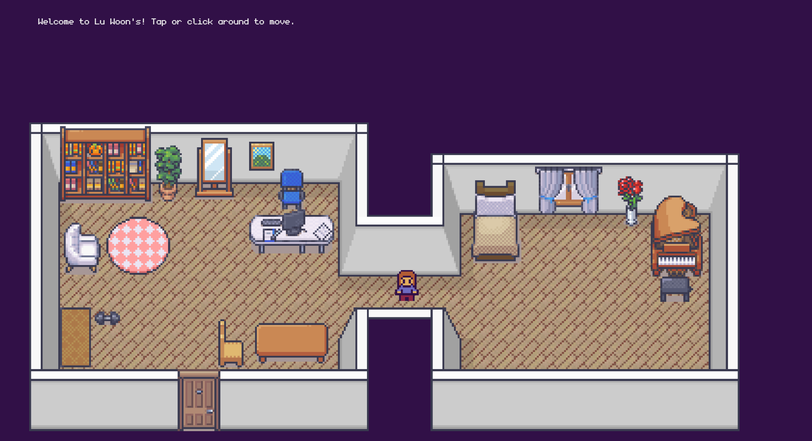

# 2D Game Portfolio Website

## Tools used: Kaboom.js, HTML, CSS

This is a personal portfolio website inspired by 2D pixel games. 

Links to the tilesets: \
https://limezu.itch.io/moderninteriors \
https://momen-games.itch.io/happy-la-v2-ts

Reference tutorial: \
https://www.youtube.com/watch?v=gwtfWORCN0U
